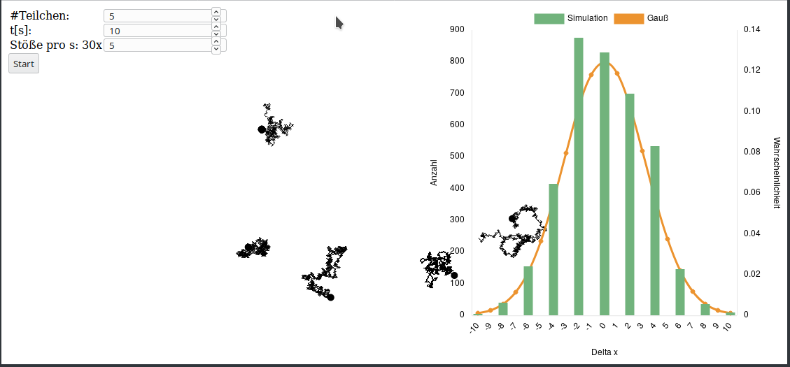

## [G(erman)EClass (WIP)](https://github.com/boundter/geclass)

The G(erman)EClass is a centralized interface for the evaluation of physics labs. It is
modeled after the [Colorado EClass](https://jila.colorado.edu/lewandowski/research/e-class-colorado-learning-attitudes-about-science-survey-experimental-physics).
Lab instructors can register with the GEClass and gain access to a questionnaire
for their students. This questionnaire measures their understanding of
experimental physics before and after the lab, to give the instructors a measure
of teaching success.

The goal is to generate enough data to study the impact of different styles of
labs on the students knowledge of experimental physics.

All this is done on a dynamic webpage. The page itself is just a user management
tool, where they can add courses and get their reports for finished courses. The
reports are generated from the external questionnaire results.

#### Used tools
- Python
  - Flask to dynamically create the webpages
  - pytest for unit testing
- sqlite for user management (only a small amount of users)
- Docker to run the webpage
- Sphinx for the documentation


## [nonlinear_systems (Version 0.1)](https://github.com/boundter/nonlinear_systems)

In its core nonlinear_systems is a header-only wrapper around the odeint package for
integration for differential equations. It allows a quick development and
separates high level abstraction, like getting the mean field, from low level
implementation.

As an added bonus there is a wrapper around the program_options lib to allow
fast creation of command line tools. All code is unit-tested and can be installed with cmake.

#### Used Tools
- C++
- CMake to build, install and test
- Doxygen for documentation
- Boost
  - odeint for integration of the ODEs
  - program_options for adding command line arguments
  - test for executing the unit-tests

#### Example
```c++
#include <iostream>
#include <vector>
#include <nonlinear_systems/systems/generic_system.hpp>
#include <nonlinear_systems/observers/position_observer.hpp>

namespace nl = nonlinear_systems;

typedef  std::vector<double> state_type;

class HarmonicOscillatorODE {
  public:
    double _omega;

    HarmonicOscillatorODE(void* params) {
      _omega = reinterpret_cast<double*>(params)[0];
    }

    void operator()(const state_type& x, state_type& dx, double t) {
      dx[0] = x[1];
      dx[1] = -_omega*_omega*x[0];
    }
};

int main() {
  double omega[] = {1.};
  auto HarmonicOsc = nl::GenericSystem<HarmonicOscillatorODE>(1, 2, omega);
  state_type initial = {0., 1.};
  HarmonicOsc.SetPosition(initial);
  std::vector<state_type> x; std::vector<double> t;
  double dt = 0.1; int n_steps = 10;
  HarmonicOsc.Integrate(dt, n_steps, nl::PositionObserver<state_type>(x, t));
  for (size_t i = 0; i < x.size(); ++i) {
    std::cout << t[i] << ": (" <<
      x[i][0] << ", " << x[i][1] << ")" << std::endl;
  }
}
```

The output of this program is

```
0: (0, 1)
0.1: (0.0998333, 0.995004)
0.2: (0.198669, 0.980067)
0.3: (0.29552, 0.955337)
0.4: (0.389418, 0.921061)
0.5: (0.479425, 0.877583)
0.6: (0.564642, 0.825336)
0.7: (0.644217, 0.764843)
0.8: (0.717356, 0.696707)
0.9: (0.783326, 0.621611)
1: (0.84147, 0.540303)
```

## [T8 (Final Version)](https://github.com/boundter/T8)

This is a rework of an experiment for the introductory lab at the University of
Potsdam. It consists of the manual in LaTeX, including some figures in Python,
and a simulation in JavaScript. A given number of particles under the influence
of Brownian motion are animated and their displacement is compared to a normal
distribution.

#### Used Tools
- LaTeX
- Python
  - numpy to generate random numbers
  - matplotlib for the plotting of the figures in the manual
- JavaScript
  - Charts.js for the dynamic plotting in the simulation



## [DAAFi (WIP)](https://github.com/boundter/DAAFi)

DAAFi stands for "Data Analysis and Administration for Finances". It is used to
organize personal finances. It also includes reports with the possibility to add
machine learning, in the form of e.g.  regression, to show trends in spending
and give a prediction for the future balance.

This is very much a work in progress and only the rudimentary interfaces are
done.

#### Used tools
- Python
  - Flask to dynamically create the webpages
  - pytest for unit testing
- sqlite for user management (only a small amount of users)
- Docker to run the webpage
